# Reporte de Practica 3.1 - Disparadores (Triggers)

## Datos Generales

- Materia: Bases de Datos
- Actividad: 3.1 (Actividad 10)
- Alumno: Dante Castelán Carpinteyro
- Fecha: 8 de mayo de 2026

## Objetivo del Reporte

Documentar la implementación del ejercicio de disparadores, mostrando la ejecución del script y evidencias de cada bloque.

## Consideraciones y portabilidad

La guía de la actividad está redactada con elementos propios de SQL Server (por ejemplo: `GETDATE()`, `USER_NAME()`, `HOST_NAME()`, `SYSTEM_USER` y el uso de `NVARCHAR`). Como preferencia personal se implementó la solución en **MySQL**, por lo que se realizaron los siguientes ajustes de portabilidad:

- **Funciones de metadatos:** se sustituyeron por equivalentes en MySQL dentro de los triggers y evidencias: `NOW()` (fecha/hora), `USER()` (usuario/sesión) y `@@hostname` (host).
- **Tipos de datos de texto:** se utilizó `VARCHAR(255)` en lugar de `NVARCHAR`, manteniendo el objetivo funcional del ejercicio.
- **Auditoría con triggers:** se implementó la tabla `logs` y disparadores `AFTER INSERT`, `AFTER UPDATE` y `AFTER DELETE` para `employees`, `jobs` y `areas`, preservando el requisito de registrar operaciones sobre las tres tablas.
- **Sintaxis específica de triggers en MySQL:** se usó `DELIMITER //` para definir bloques `BEGIN ... END`.
- **Compatibilidad de nomenclatura:** se respetó la intención del modelo solicitado (Empleados, Puestos, Áreas), adaptando nombres a convención en inglés (`employees`, `jobs`, `areas`) para mantener consistencia en todo el script y para mantener mis preferencias en cuanto a nombres.

Con estos cambios, la práctica cumple los requerimientos funcionales solicitados, manteniendo equivalencia técnica entre lo pedido en SQL Server y su ejecución en MySQL.

## Instrucciones de la práctica

Según [practices/activity-3-1/instructions.md](instructions.md):

> 1. Crear una base de datos que se llame "personal".
> 2. Dentro de la base de datos creada, crear 3 tablas con las estructuras solicitadas (Empleados, Puestos y Areas).
> 3. Crear una tabla de auditoría para registrar operaciones sobre AREAS, EMPLEADOS y PUESTOS.
> 4. Insertar mínimo 11 registros por tabla, actualizar al menos 2 por tabla y eliminar el ultimo registro para dejar 10.

## Implementación

El script completo se puede encontrar en: [practices/activity-3-1/source_query.sql](source_query.sql)

### Creación de las tablas

```sql
# Tabla de empleados
CREATE TABLE `personal`.`employees` (
  `id_employee` int UNSIGNED NOT NULL AUTO_INCREMENT,
  `name_employee` varchar(255) NOT NULL,
  `last_name_1_employee` varchar(255) NOT NULL,
  `last_name_2_employee` varchar(255) NOT NULL,
  `id_job` int UNSIGNED NOT NULL,
  `id_area` int UNSIGNED NOT NULL,
  PRIMARY KEY (`id_employee`)
);
```

```sql
# Tabla de puestos
CREATE TABLE `personal`.`jobs` (
  `id_job` int UNSIGNED NOT NULL AUTO_INCREMENT,
  `description_job` varchar(255) NULL,
  PRIMARY KEY (`id_job`)
);
```

```sql
# Tabla de áreas
CREATE TABLE `personal`.`areas` (
  `id_area` int(10) unsigned NOT NULL AUTO_INCREMENT,
  `description_area` varchar(255) DEFAULT NULL,
  PRIMARY KEY (`id_area`)
);
```

La ejecución es correcta:
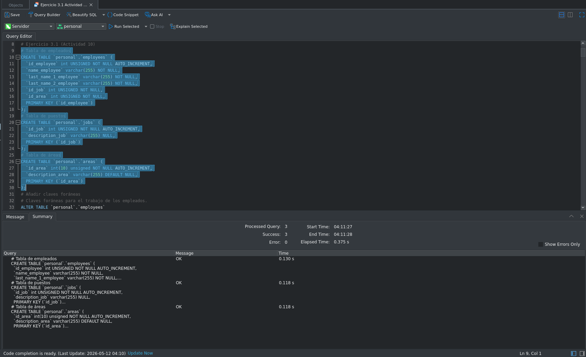

### Creación de claves foráneas

Añado las llaves foráneas a las tablas para mantener la integridad referencial:

```sql
# Añadir claves foráneas
# Claves foráneas para el trabajo de los empleados.
ALTER TABLE `personal`.`employees`
ADD CONSTRAINT `fk_employee_job` FOREIGN KEY (`id_job`) REFERENCES `personal`.`jobs` (`id_job`) ON DELETE CASCADE ON UPDATE CASCADE;
# Claves foráneas para el área de los empleados.
ALTER TABLE `personal`.`employees`
ADD CONSTRAINT `fk_employee_area` FOREIGN KEY (`id_area`) REFERENCES `personal`.`areas` (`id_area`) ON DELETE CASCADE ON UPDATE CASCADE;
```

La ejecución es correcta:
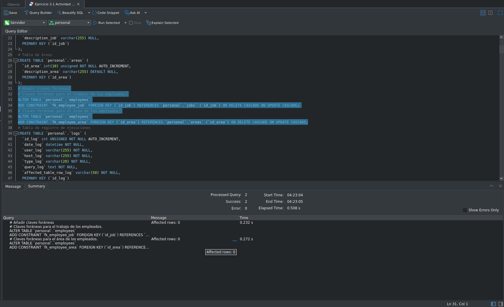

### Creación de la tabla de auditoría

```sql
# Tabla de registro de ejecuciones
CREATE TABLE `personal`.`logs` (
  `id_log` int UNSIGNED NOT NULL AUTO_INCREMENT,
  `date_log` datetime NOT NULL,
  `user_log` varchar(255) NOT NULL,
  `host_log` varchar(255) NOT NULL,
  `type_log` varchar(20) NOT NULL,
  `query_log` text NOT NULL,
  `affected_table_row_log` varchar(50) NOT NULL,
  PRIMARY KEY (`id_log`)
);
```

La ejecución es correcta:
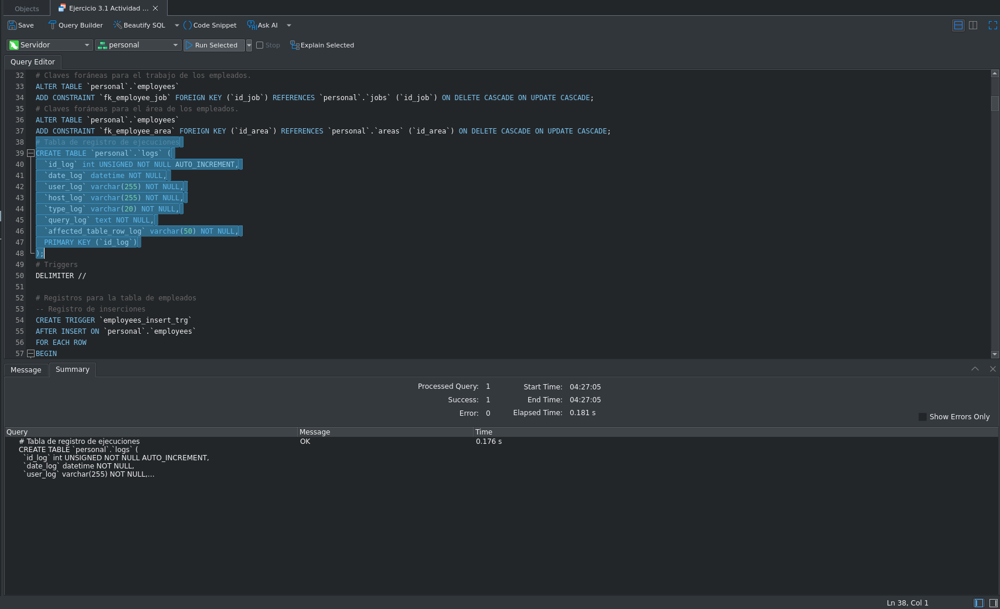

### Creación de triggers

Añado triggers para que en la tabla de logs se registre cada acción realizada, aún cuando se lleve a cabo una operación CRUD que afecte a varias filas:

```sql
# Triggers
DELIMITER //
```

Establezco el delimitador:
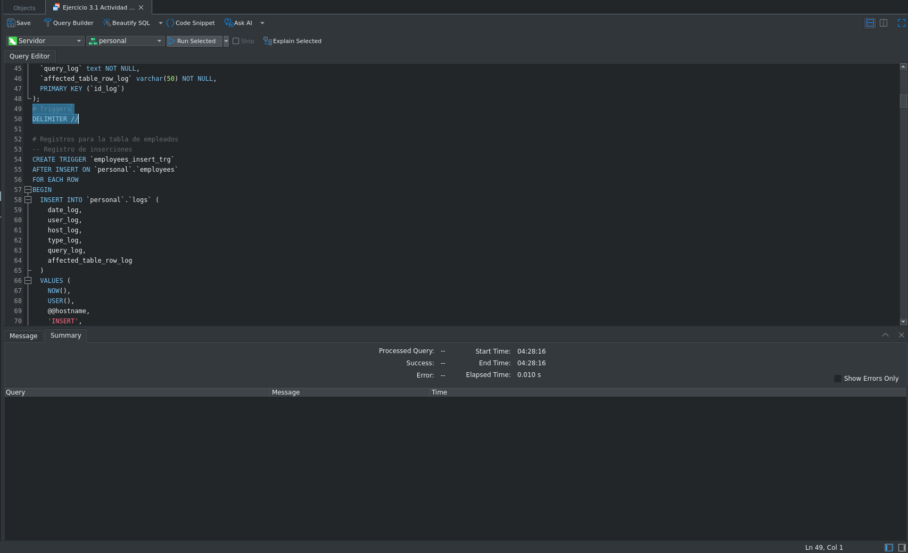

```sql
# Registros para la tabla de empleados
-- Registro de inserciones
CREATE TRIGGER `employees_insert_trg`
AFTER INSERT ON `personal`.`employees`
FOR EACH ROW
BEGIN
  INSERT INTO `personal`.`logs` (
    date_log,
    user_log,
    host_log,
    type_log,
    query_log,
    affected_table_row_log
  )
  VALUES (
    NOW(),
    USER(),
    @@hostname,
    'INSERT',
    CONCAT(
      'INSERT INTO `personal`.`employees` (`name_employee`, `last_name_1_employee`, `last_name_2_employee`, `id_job`, `id_area`) VALUES (',
      QUOTE(NEW.name_employee), ', ',
      QUOTE(NEW.last_name_1_employee), ', ',
      QUOTE(NEW.last_name_2_employee), ', ',
      NEW.id_job, ', ',
      NEW.id_area,
      ');'
    ),
    'employees'
  );
END //
 
-- Registro de actualizaciones
CREATE TRIGGER `employees_update_trg`
AFTER UPDATE ON `personal`.`employees`
FOR EACH ROW
BEGIN
  INSERT INTO `personal`.`logs` (
    date_log,
    user_log,
    host_log,
    type_log,
    query_log,
    affected_table_row_log
  )
  VALUES (
    NOW(),
    USER(),
    @@hostname,
    'UPDATE',
    CONCAT(
      'UPDATE `personal`.`employees` SET `name_employee` = ', QUOTE(NEW.name_employee),
      ', `last_name_1_employee` = ', QUOTE(NEW.last_name_1_employee),
      ', `last_name_2_employee` = ', QUOTE(NEW.last_name_2_employee),
      ', `id_job` = ', NEW.id_job,
      ', `id_area` = ', NEW.id_area,
      ' WHERE `id_employee` = ', OLD.id_employee,
      ';'
    ),
    'employees'
  );
END //
 
-- Registro de eliminaciones
CREATE TRIGGER `employees_delete_trg`
AFTER DELETE ON `personal`.`employees`
FOR EACH ROW
BEGIN
  INSERT INTO `personal`.`logs` (
    date_log,
    user_log,
    host_log,
    type_log,
    query_log,
    affected_table_row_log
  )
  VALUES (
    NOW(),
    USER(),
    @@hostname,
    'DELETE',
    CONCAT(
      'DELETE FROM `personal`.`employees` WHERE `id_employee` = ',
      OLD.id_employee,
      ';'
    ),
    'employees'
  );
END //
```

Los triggers para los empleados se crean correctamente:


```sql
# Registros para la tabla de puestos
-- Registro de inserciones
CREATE TRIGGER `jobs_insert_trg`
AFTER INSERT ON `personal`.`jobs`
FOR EACH ROW
BEGIN
  INSERT INTO `personal`.`logs` (
    date_log,
    user_log,
    host_log,
    type_log,
    query_log,
    affected_table_row_log
  )
  VALUES (
    NOW(),
    USER(),
    @@hostname,
    'INSERT',
    CONCAT(
      'INSERT INTO `personal`.`jobs` (`description_job`) VALUES (',
      QUOTE(NEW.description_job),
      ');'
    ),
    'jobs'
  );
END //

-- Registro de actualizaciones
CREATE TRIGGER `jobs_update_trg`
AFTER UPDATE ON `personal`.`jobs`
FOR EACH ROW
BEGIN
  INSERT INTO `personal`.`logs` (
    date_log,
    user_log,
    host_log,
    type_log,
    query_log,
    affected_table_row_log
  )
  VALUES (
    NOW(),
    USER(),
    @@hostname,
    'UPDATE',
    CONCAT(
      'UPDATE `personal`.`jobs` SET `description_job` = ',
      QUOTE(NEW.description_job),
      ' WHERE `id_job` = ',
      OLD.id_job,
      ';'
    ),
    'jobs'
  );
END //

-- Registro de eliminaciones
CREATE TRIGGER `jobs_delete_trg`
AFTER DELETE ON `personal`.`jobs`
FOR EACH ROW
BEGIN
  INSERT INTO `personal`.`logs` (
    date_log,
    user_log,
    host_log,
    type_log,
    query_log,
    affected_table_row_log
  )
  VALUES (
    NOW(),
    USER(),
    @@hostname,
    'DELETE',
    CONCAT(
      'DELETE FROM `personal`.`jobs` WHERE `id_job` = ',
      OLD.id_job,
      ';'
    ),
    'jobs'
  );
END //
```

Los triggers para los puestos se crean correctamente:
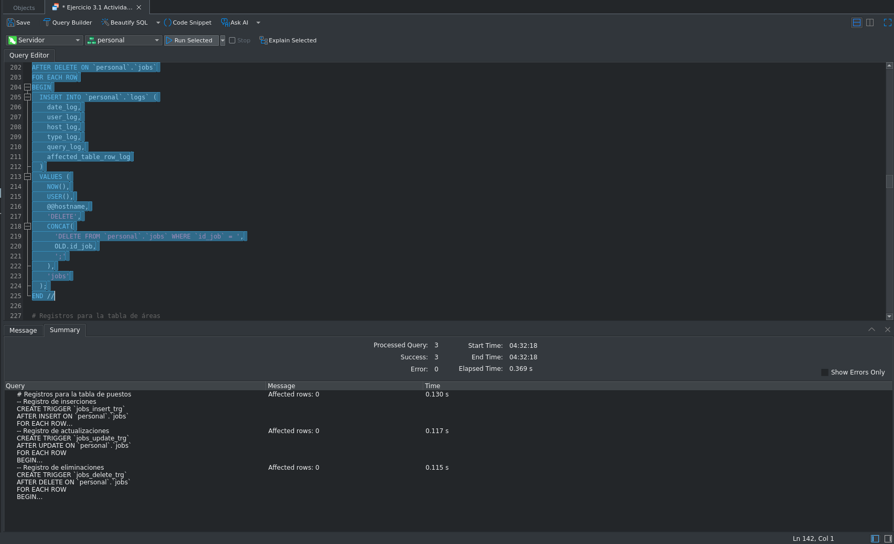

```sql
# Registros para la tabla de áreas
-- Registro de inserciones
CREATE TRIGGER `areas_insert_trg`
AFTER INSERT ON `personal`.`areas`
FOR EACH ROW
BEGIN
  INSERT INTO `personal`.`logs` (
    date_log,
    user_log,
    host_log,
    type_log,
    query_log,
    affected_table_row_log
  )
  VALUES (
    NOW(),
    USER(),
    @@hostname,
    'INSERT',
    CONCAT(
      'INSERT INTO `personal`.`areas` (`description_area`) VALUES (',
      QUOTE(NEW.description_area),
      ');'
    ),
    'areas'
  );
END //

-- Registro de actualizaciones
CREATE TRIGGER `areas_update_trg`
AFTER UPDATE ON `personal`.`areas`
FOR EACH ROW
BEGIN
  INSERT INTO `personal`.`logs` (
    date_log,
    user_log,
    host_log,
    type_log,
    query_log,
    affected_table_row_log
  )
  VALUES (
    NOW(),
    USER(),
    @@hostname,
    'UPDATE',
    CONCAT(
      'UPDATE `personal`.`areas` SET `description_area` = ',
      QUOTE(NEW.description_area),
      ' WHERE `id_area` = ',
      OLD.id_area,
      ';'
    ),
    'areas'
  );
END //

-- Registro de eliminaciones
CREATE TRIGGER `areas_delete_trg`
AFTER DELETE ON `personal`.`areas`
FOR EACH ROW
BEGIN
  INSERT INTO `personal`.`logs` (
    date_log,
    user_log,
    host_log,
    type_log,
    query_log,
    affected_table_row_log
  )
  VALUES (
    NOW(),
    USER(),
    @@hostname,
    'DELETE',
    CONCAT(
      'DELETE FROM `personal`.`areas` WHERE `id_area` = ',
      OLD.id_area,
      ';'
    ),
    'areas'
  );
END //
```

```sql
DELIMITER ;
```

Los triggers para las áreas se crean correctamente:
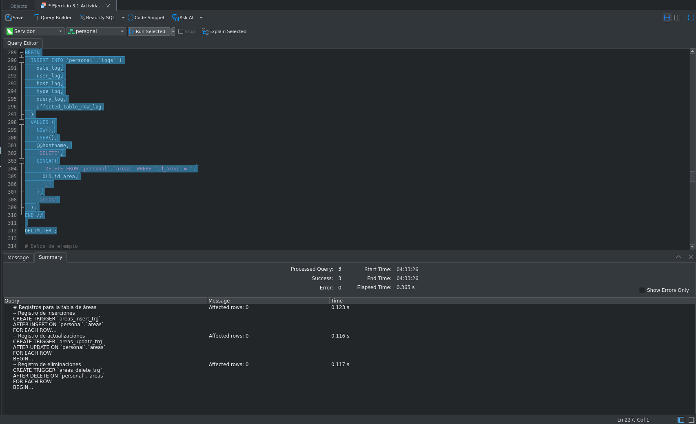

### Inserción de datos

Inserto datos de ejemplo a las tres tablas: 11 registros a cada una.

```sql
# Inserciones en tabla de puestos
INSERT INTO `personal`.`jobs` (`description_job`)
VALUES ('Software Engineer'),
  ('Database Administrator'),
  ('Systems Analyst'),
  ('QA Engineer'),
  ('Project Manager'),
  ('UX Designer'),
  ('DevOps Engineer'),
  ('Backend Developer'),
  ('Frontend Developer'),
  ('Support Engineer'),
  ('Data Analyst');
```

```sql
# Inserciones en tabla de áreas
INSERT INTO `personal`.`areas` (`description_area`)
VALUES ('Technology'),
  ('Human Resources'),
  ('Finance'),
  ('Operations'),
  ('Marketing'),
  ('Sales'),
  ('Customer Service'),
  ('Logistics'),
  ('Security'),
  ('Legal'),
  ('Research and Development');
```

```sql
# Inserciones en tabla de empleados
INSERT INTO `personal`.`employees` (
    `name_employee`,
    `last_name_1_employee`,
    `last_name_2_employee`,
    `id_job`,
    `id_area`
  )
VALUES ('Dante', 'Castelán', 'Carpinteyro', 1, 1),
  ('Emiliano', 'Castelán', 'Carpinteyro', 2, 3),
  ('Andrea', 'Castelán', 'Carpinteyro', 3, 4),
  ('Luis', 'Ramirez', 'Torres', 4, 1),
  ('Valeria', 'Flores', 'Mendez', 5, 5),
  ('Diego', 'Castro', 'Nunez', 6, 5),
  ('Elena', 'Vargas', 'Pineda', 7, 4),
  ('Jorge', 'Santos', 'Morales', 8, 1),
  ('Fernanda', 'Ortega', 'Vega', 9, 6),
  ('Ricardo', 'Navarro', 'Silva', 10, 7),
  ('Paula', 'Ibarra', 'Rios', 11, 11);
```

Realizo las inserciones y verifico que se hayan reflejado en sus respectivas tablas, así como en la de logs (2 imágenes):
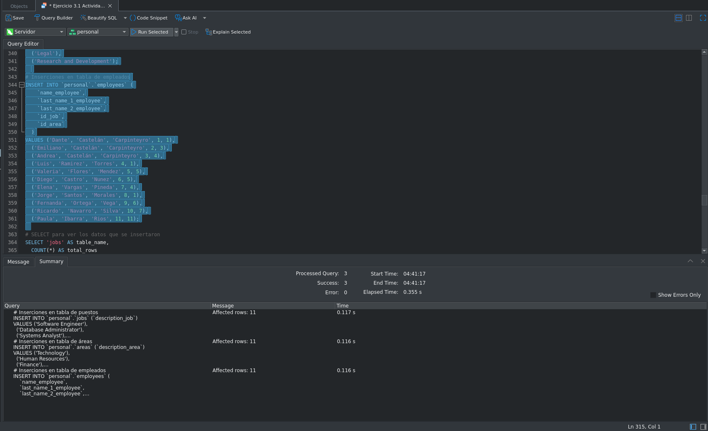
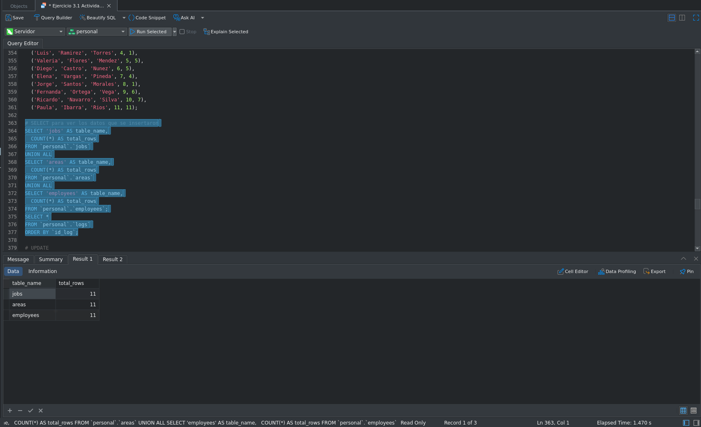

Luego, hago la actualización de dos registros a cada tabla:

```sql
# Puestos
UPDATE `personal`.`jobs`
SET `description_job` = 'Senior Software Engineer'
WHERE `id_job` = 1;
UPDATE `personal`.`jobs`
SET `description_job` = 'Lead Database Administrator'
WHERE `id_job` = 2;
```

```sql
# Áreas
UPDATE `personal`.`areas`
SET `description_area` = 'Information Technology'
WHERE `id_area` = 1;
UPDATE `personal`.`areas`
SET `description_area` = 'Corporate Finance'
WHERE `id_area` = 3;
```

```sql
# Empleados
UPDATE `personal`.`employees`
SET `name_employee` = 'Ana Maria'
WHERE `id_employee` = 1;
UPDATE `personal`.`employees`
SET `last_name_2_employee` = 'Delgado'
WHERE `id_employee` = 2;
```

Ejecución de las actualizaciones:
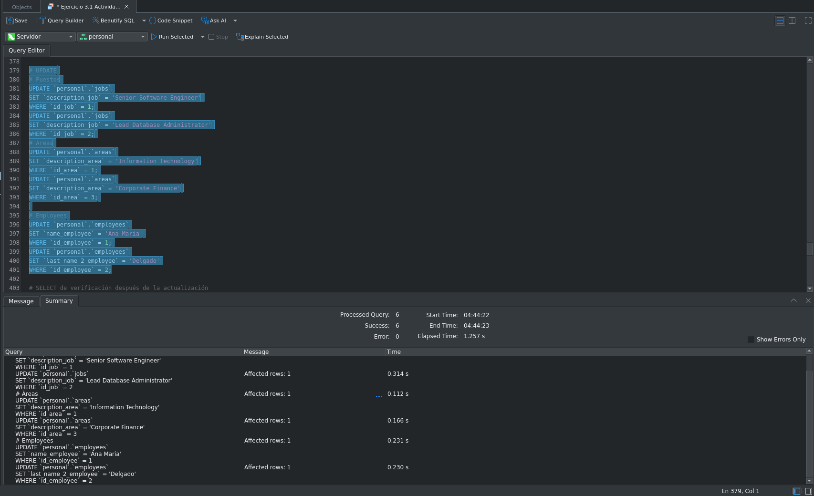

Verifico que los cambios se hayan aplicado correctamente en cada tabla y que los triggers hayan registrado las operaciones en logs:

```sql
# SELECT de verificación después de la actualización
SELECT `id_job`, `description_job`
FROM `personal`.`jobs`
WHERE `id_job` IN (1, 2);

SELECT `id_area`, `description_area`
FROM `personal`.`areas`
WHERE `id_area` IN (1, 3);

SELECT `id_employee`, `name_employee`, `last_name_2_employee`
FROM `personal`.`employees`
WHERE `id_employee` IN (1, 2);

SELECT * FROM `personal`.`logs` ORDER BY `id_log`;
```

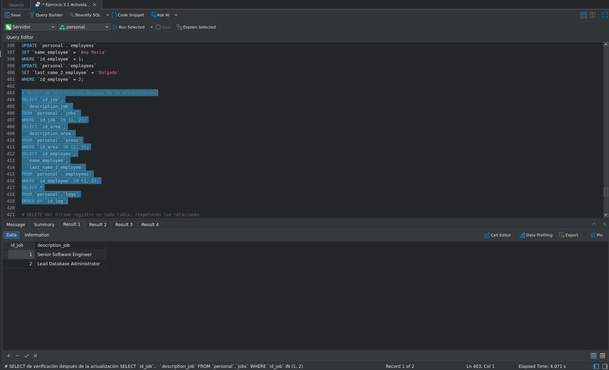

### Eliminación de registros

Elimino el último registro de cada tabla respetando el orden de las relaciones (primero employees, luego jobs y areas) para no violar las restricciones de las llaves foráneas:

```sql
# DELETE del último registro en cada tabla, respetando las relaciones
# 1) employees, 2) jobs, 3) areas
DELETE FROM `personal`.`employees`
WHERE `id_employee` = (
    SELECT MAX(id_employee)
    FROM (
        SELECT `id_employee`
        FROM `personal`.`employees`
      ) AS e
  );

DELETE FROM `personal`.`jobs`
WHERE `id_job` = (
    SELECT MAX(id_job)
    FROM (
        SELECT `id_job`
        FROM `personal`.`jobs`
      ) AS j
  );

DELETE FROM `personal`.`areas`
WHERE `id_area` = (
    SELECT MAX(id_area)
    FROM (
        SELECT `id_area`
        FROM `personal`.`areas`
      ) AS a
  );
```

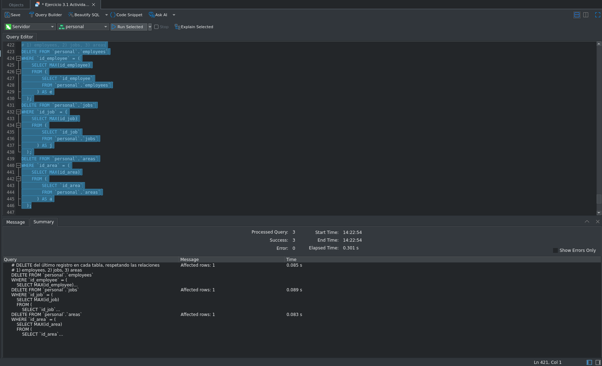

Verifico que cada tabla haya quedado con exactamente 10 registros y que los triggers hayan registrado las eliminaciones en logs:

```sql
# SELECT de verificación post-delete
SELECT 'jobs' AS table_name, COUNT(*) AS total_rows FROM `personal`.`jobs`
UNION ALL
SELECT 'areas' AS table_name, COUNT(*) AS total_rows FROM `personal`.`areas`
UNION ALL
SELECT 'employees' AS table_name, COUNT(*) AS total_rows FROM `personal`.`employees`;

SELECT * FROM `personal`.`logs` ORDER BY `id_log`;
```

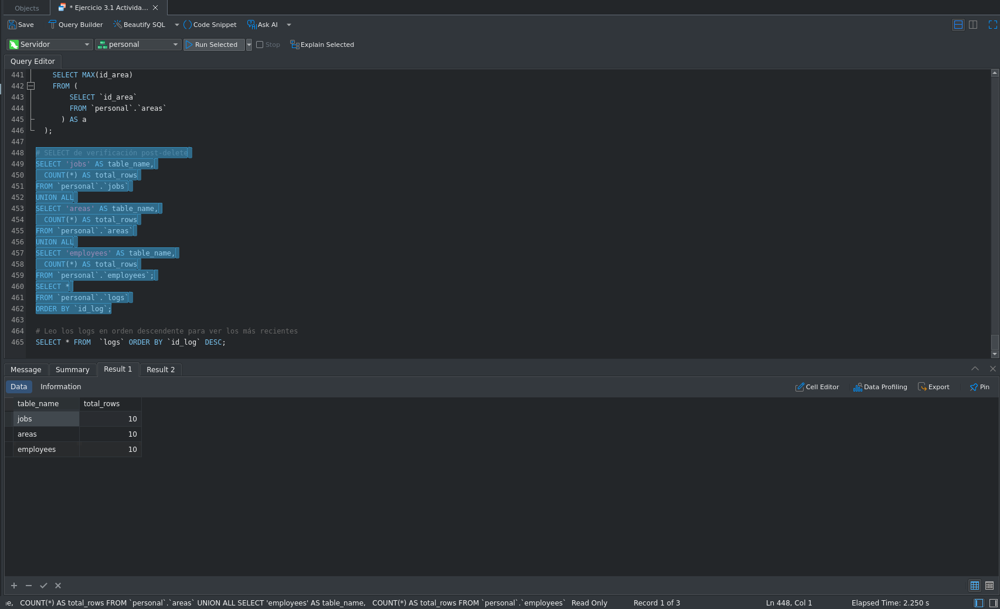

Por último, consulto los logs en orden descendente para revisar los registros más recientes primero:

```sql
# Leo los logs en orden descendente para ver los más recientes
SELECT * FROM `personal`.`logs` ORDER BY `id_log` DESC;
```

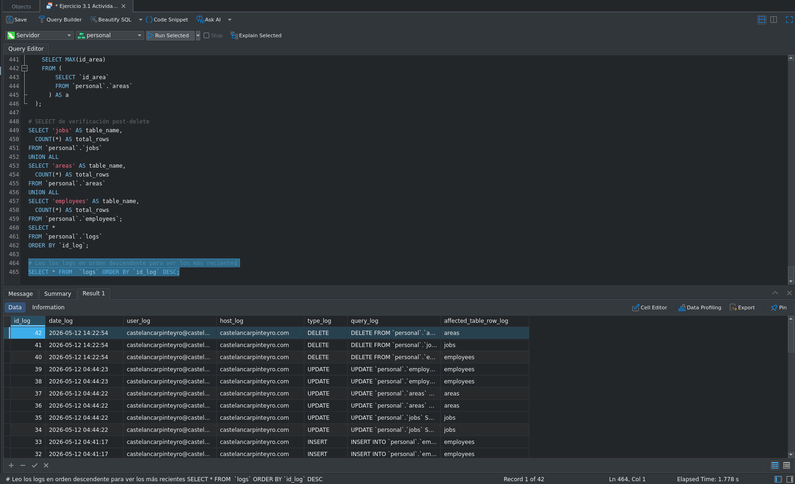

## Resultados esperados

- Las tablas principales deben crearse correctamente.
- Los triggers deben registrar INSERT, UPDATE y DELETE en logs.
- Deben existir evidencias de inserciones, actualizaciones y eliminaciones según la práctica.

## Conclusiones

Crear tablas y llaves foráneas entre ellas para mantener la integridad es una buena práctica; pero tener un registro de las operaciones que cualquier usuario realice es fundamental para cualquier administrador de sistemas y -en este caso- de bases de datos puesto que permite detectar cada acción que se realiza y así poder tener una respuesta en caso de incidentes o de manipulación indebida de datos.

Es por ello que el uso de triggers es la mejor estrategia para tener una automatización del flujo de registro de las operaciones cotidianas.
